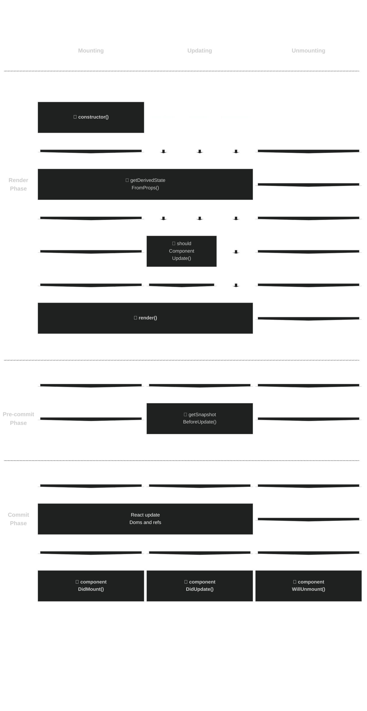

# React Life Cycle Vis

💖 Reproducing [react lifecycle chart](https://projects.wojtekmaj.pl/react-lifecycle-methods-diagram/) with less than 200 lines (mermaid) markdown.

🤔 Plan to add more stuffs to make it more complete.

