# React Life Cycle Vis

💖 Reproducing [react lifecycle chart](https://projects.wojtekmaj.pl/react-lifecycle-methods-diagram/) with about 300 lines (mermaid) markdown.

🤔 Plan to add more stuffs to make it more complete.

```mermaid
%%{
    init: {
        'theme': 'dark'
    }
}%%
block-beta
    classDef BORDER_NONE fill: none, stroke: none;
    classDef DASH_LINE stroke-dasharray: 5,5, height: 1px, stroke-width: 1px;
    classDef DOWN_ARROW transform: translateY(16px) translateX(16px) scale(2) rotate(-90deg);
    classDef HIDDEN display:none;
    columns 10

%% row 0
DL_ROW_SUBROW_000[" "]:10
class DL_ROW_SUBROW_000 HIDDEN

%% row 1
    %% PHASE
        space:1

    %% MOUNTING
        Mounting["<h3>Mounting</h3>"]:3

    %% UPDATING
        Updating["<h3>Updating</h3>"]:3

    %% UNMOUNTING
        Unmounting["<h3>Unmounting</h3>"]:3

    class
        z,Mounting,
        z,Updating,
        z,Unmounting,
    z BORDER_NONE

%% row 2
    block:D_ROW_002:10
        DL_ROW_002[" "]
        class DL_ROW_002 DASH_LINE
    end
    class D_ROW_002 BORDER_NONE

%% row 3
    %% PHASE
        space:1

    %% MOUNTING
        constructorCall["🔗 <b><a href="https://legacy.reactjs.org/docs/react-component.html#constructor" style="text-decoration:none;color:#ccc;">constructor()</a></b>"]:3

    %% UPDATING
        NewProps["<i>New Props</i>"]
        setStateCall["setState()"]
        forceUpdateCall["forceUpdate()"]
        class
            z,NewProps,
            z,setStateCall,
            z,forceUpdateCall,
        z BORDER_NONE

    %% UNMOUNTING
        space:3

%% row 4
    %% PHASE
        space:1

    %% MOUNTING
        A_ROW_004_COL_002_004 <[" "]>(left):3

    %% UPDATING
        A_ROW_004_COL_004_005 <[" "]>(left):1
        A_ROW_004_COL_005_006 <[" "]>(left):1
        A_ROW_004_COL_006_007 <[" "]>(left):1

    %% UNMOUNTING
        A_ROW_004_COL_008_010 <[" "]>(left):3

%% row 5
    %% PHASE
        renderPhase["<h3>Render\nPhase</h3>"]:1
        class renderPhase BORDER_NONE

    %% MOUNTING
    %% UPDATING
        getDerivedStateFromPropsCall["<a href="https://legacy.reactjs.org/docs/react-component.html#static-getderivedstatefromprops" style="text-decoration:none;color:#ccc;">🔗 getDerivedState\nFromProps()</a>"]:6

   %% UNMOUNTING
        A_ROW_005_COL_008_010 <[" "]>(left):3

%% row 6
    %% PHASE
        space:1

    %% MOUNTING
        A_ROW_006_COL_002_004 <[" "]>(left):3

    %% UPDATING
        A_ROW_006_COL_005_006 <[" "]>(left):1
        A_ROW_006_COL_006_007 <[" "]>(left):1
        A_ROW_006_COL_007_008 <[" "]>(left):1

    %% UNMOUNTING
        A_ROW_006_COL_008_010 <[" "]>(left):3

%% row 7
    %% PHASE
        space:1

    %% MOUNTING
        A_ROW_007_COL_002_004 <[" "]>(left):3

    %% UPDATING
        shouldComponentUpdateCall["<a href="https://legacy.reactjs.org/docs/react-component.html#shouldcomponentupdate" style="text-decoration:none;color:#ccc;">🔗 should\nComponent\nUpdate()</a>"]:2
        A_ROW_007_COL_006_007 <[" "]>(left):1

    %% UNMOUNTING
        A_ROW_007_COL_008_010 <[" "]>(left):3

%% row 8
    %% PHASE
        space:1

    %% MOUNTING
        A_ROW_008_COL_002_004 <[" "]>(left):3

    %% UPDATING
        A_ROW_008_COL_004_005<[" "]>(left):2
        A_ROW_008_COL_007_008 <[" "]>(left):1

    %% UNMOUNTING
        A_ROW_008_COL_008_010 <[" "]>(left):3

%% row 9
    %% PHASE
        space:1

    %% MOUNTING
    %% UPDATING
        renderCall["🔗 <b><a href="https://legacy.reactjs.org/docs/react-component.html#render" style="text-decoration:none;color:#ccc;">render()</a></b>"]:6

    %% UNMOUNTING
        A_ROW_009_COL_008_010 <[" "]>(left):3

%% row 10
    block:D_ROW_010:10
        columns 1
        DL_ROW_010_SUBROW_001[" "]
        DL_ROW_010_SUBROW_002[" "]
        DL_ROW_010_SUBROW_003[" "]
        DL_ROW_010_SUBROW_004[" "]

        class
            z,DL_ROW_010_SUBROW_001,
            z,DL_ROW_010_SUBROW_002,
            z,DL_ROW_010_SUBROW_003,
        z HIDDEN
        class DL_ROW_010_SUBROW_004 DASH_LINE
    end
    class D_ROW_010 BORDER_NONE

%% row 11
    %% PHASE
        space:1

    %% MOUNTING
        A_ROW_011_COL_002_004 <[" "]>(left):3

    %% UPDATING
        A_ROW_011_COL_005_007 <[" "]>(left):3

    %% UNMOUNTING
        A_ROW_011_COL_008_010 <[" "]>(left):3

%% row 12
    %% PHASE
        preCommitPhase["<h3>Pre-commit\nPhase</h3>"]:1
        class preCommitPhase BORDER_NONE

    %% MOUNTING
        A_ROW_012_COL_002_004 <[" "]>(left):3

    %% UPDATING
        classDef LINK text-decoration:none,color:#ccc
        getSnapshotBeforeUpdateCall["<a href="https://legacy.reactjs.org/docs/react-component.html#getsnapshotbeforeupdate" style="text-decoration:none;color:#ccc;">🔗 getSnapshot\nBeforeUpdate()</a>"]:3

    %% UNMOUNTING
        A_ROW_012_COL_008_010 <[" "]>(left):3

%% row 13
    block:D_ROW_013:10
        columns 1
        DL_ROW_013_SUBROW_001[" "]
        DL_ROW_013_SUBROW_002[" "]
        DL_ROW_013_SUBROW_003[" "]
        DL_ROW_013_SUBROW_004[" "]

        class
            z,DL_ROW_013_SUBROW_001,
            z,DL_ROW_013_SUBROW_002,
            z,DL_ROW_013_SUBROW_003,
        z HIDDEN
        class DL_ROW_013_SUBROW_004 DASH_LINE
    end
    class D_ROW_013 BORDER_NONE

%% row 14
    %% PHASE
        space:1

    %% MOUNTING
        A_ROW_014_COL_002_004 <[" "]>(left):3

    %% UPDATING
        A_ROW_014_COL_005_007 <[" "]>(left):3

    %% UNMOUNTING
        A_ROW_014_COL_008_010 <[" "]>(left):3

%% row 15
    %% PHASE
        commitPhase["<h3>Commit\nPhase</h3>"]:1
        class commitPhase BORDER_NONE

    %% MOUNTING
    %% UPDATING
        reactUpdateDomAndRef["React update\nDoms and refs"]:6

    %% UNMOUNTING
        A_ROW_015_COL_008_010 <[" "]>(left):3

%% row 16
    %% PHASE
        space:1

    %% MOUNTING
        A_ROW_016_COL_002_004  <[" "]>(left):3

    %% UPDATING
        A_ROW_016_COL_005_007  <[" "]>(left):3

    %% UNMOUNTING
        A_ROW_016_COL_008_010 <[" "]>(left):3

%% row 17
    %% PHASE
        space:1

    %% MOUNTING
        componentDidMountCall["🔗 <b><a href="https://legacy.reactjs.org/docs/react-component.html#componentdidmount" style="text-decoration:none;color:#ccc;">component\nDidMount()</a></b>"]:3

    %% UPDATING
        componentDidUpdateCall["🔗 <b><a href="https://legacy.reactjs.org/docs/react-component.html#componentdidupdate" style="text-decoration:none;color:#ccc;">component\nDidUpdate()</a></b>"]:3

    %% UNMOUNTING
        componentWillUnmountCall["🔗 <b><a href="https://legacy.reactjs.org/docs/react-component.html#componentwillunmount" style="text-decoration:none;color:#ccc;">component\nWillUnmount()</a></b>"]:3

%% row inf
    DL_ROW_INF_SUBROW_001[" "]:10
    DL_ROW_INF_SUBROW_002[" "]:10
    DL_ROW_INF_SUBROW_003[" "]:10
    DL_ROW_INF_SUBROW_004[" "]:10
    DL_ROW_INF_SUBROW_005[" "]:10
    DL_ROW_INF_SUBROW_006[" "]:10
    class
        z,DL_ROW_INF_SUBROW_001,
        z,DL_ROW_INF_SUBROW_002,
        z,DL_ROW_INF_SUBROW_003,
        z,DL_ROW_INF_SUBROW_004,
        z,DL_ROW_INF_SUBROW_005,
        z,DL_ROW_INF_SUBROW_006,
    z HIDDEN

class
    z,
    z,A_ROW_004_COL_002_004,
    z,A_ROW_004_COL_004_005,
    z,A_ROW_004_COL_005_006,
    z,A_ROW_004_COL_006_007,
    z,A_ROW_004_COL_008_010,
    z,
    z,A_ROW_005_COL_008_010,
    z,
    z,A_ROW_006_COL_002_004,
    z,A_ROW_006_COL_005_006,
    z,A_ROW_006_COL_006_007,
    z,A_ROW_006_COL_007_008,
    z,A_ROW_006_COL_008_010,
    z,
    z,A_ROW_007_COL_002_004,
    z,A_ROW_007_COL_006_007,
    z,A_ROW_007_COL_008_010,
    z,A_ROW_008_COL_002_004,
    z,A_ROW_008_COL_004_005,
    z,A_ROW_008_COL_007_008,
    z,A_ROW_008_COL_008_010,
    z,
    z,A_ROW_009_COL_008_010,
    z,
    z,A_ROW_011_COL_002_004,
    z,A_ROW_011_COL_005_007,
    z,A_ROW_011_COL_008_010,
    z,
    z,A_ROW_012_COL_002_004,
    z,A_ROW_012_COL_008_010,
    z,
    z,A_ROW_014_COL_002_004,
    z,A_ROW_014_COL_005_007,
    z,A_ROW_014_COL_008_010,
    z,
    z,A_ROW_015_COL_008_010,
    z,
    z,A_ROW_016_COL_002_004,
    z,A_ROW_016_COL_005_007,
    z,A_ROW_016_COL_008_010,
    z,
z DOWN_ARROW
```

